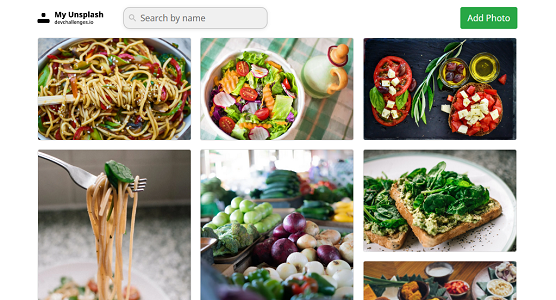

<h1 align="center">My Unsplash</h1>

<div align="center">
   Solution for a challenge from  <a href="http://devchallenges.io" target="_blank">Devchallenges.io</a>.
</div>

<div align="center">
  <h3>
    <a href="https://devc-my-unsplash.herokuapp.com/">
      Demo
    </a>
    <span> | </span>
    <a href="https://devchallenges.io/solutions/wGXwQNtaG8x6gMIJoDYZ">
      Solution
    </a>
    <span> | </span>
    <a href="https://devchallenges.io/challenges/rYyhwJAxMfES5jNQ9YsP">
      Challenge
    </a>
  </h3>
</div>

<!-- TABLE OF CONTENTS -->

## Table of Contents

- [Overview](#overview)
  - [Built With](#built-with)
  - [Tested With](#tested-with)
- [Features](#features)
- [How to use](#how-to-use)
- [Contact](#contact)
- [Acknowledgements](#acknowledgements)
  - [Packages](#packages)

<!-- OVERVIEW -->

## Overview



It's my first full MERN stack app. Working with redux slice was new to me, but it was easy to implement with their example. I tried to use a proper structure for this project. Bootstrap really made the modals easy to implement. I felt Masonry would have been easier to implement on vanilla JS than React, I couldn't get it to place images based on size rather than count, ended up using XMasonry package.

[Demo Link](https://devc-my-unsplash.herokuapp.com/)

### Built With

- [React](https://reactjs.org/)
- [Redux](https://redux.js.org/)
- [Bootstrap](https://getbootstrap.com/)
- [Sass](https://sass-lang.com/)
- [Express](https://expressjs.com/)
- [MongoDB](https://www.mongodb.com/)

### Tested With

- [Jest](https://jestjs.io/)
- [React Testing Library](https://testing-library.com/docs/react-testing-library/intro/)
- [Chai](https://www.chaijs.com/)
- [Mocha](https://mochajs.org/)

## Features

<!-- List the features of your application or follow the template. Don't share the figma file here :) -->

This application/site was created as a submission to a [DevChallenges](https://devchallenges.io/challenges) challenge. The [challenge](https://devchallenges.io/challenges/rYyhwJAxMfES5jNQ9YsP) was to build an application to complete the given user stories.

- View images in Masonry.
- Use search to filter by creator's name.
- Add photo by providing url and creator's name.
- Hover over an image to see name and delete option.
- Ask for password to delete.

## How To Use

<!-- Example: -->

To clone and run this application, you'll need [Git](https://git-scm.com) and [Node.js](https://nodejs.org/en/download/) (which comes with [npm](http://npmjs.com)) installed on your computer. From your command line:

```bash
# Clone this repository
$ git clone https://github.com/your-user-name/your-project-name

# Install dependencies
$ npm install

# Run the app
$ npm start

# Visit app on localhost:5000
```

## Acknowledgements

- [Writing Tests for Redux](https://redux.js.org/recipes/writing-tests)
- [Testing a Nodejs API with Mocha and Chai](https://medium.com/@ebenwoodward/testing-a-node-js-with-mocha-and-chai-11288460eaf8)
- [How to Create Node.js, Express.js, and MongoDB CRUD Web Application](https://www.djamware.com/post/58b27ce080aca72c54645983/how-to-create-nodejs-expressjs-and-mongodb-crud-web-application)
- [Heroku](https://www.heroku.com/)
- [Node.js](https://nodejs.org/)
- [Marked - a markdown parser](https://github.com/chjj/marked)

### Packages

- [XMasonry](https://www.npmjs.com/package/react-xmasonry)
- [Mongoose](https://www.npmjs.com/package/mongoose)
- [dotenv](https://www.npmjs.com/package/dotenv)
- [body-parser](https://www.npmjs.com/package/body-parser)
- [SuperTest](https://www.npmjs.com/package/supertest)
- [fetch-mock-jest](https://www.npmjs.com/package/fetch-mock-jest)
- [redux-mock-store](https://www.npmjs.com/package/redux-mock-store)

## Contact

- Website [srikant-n.github.io](https://srikant-n.github.io/)
- GitHub [@srikant-n](https://github.com/srikant-n)
